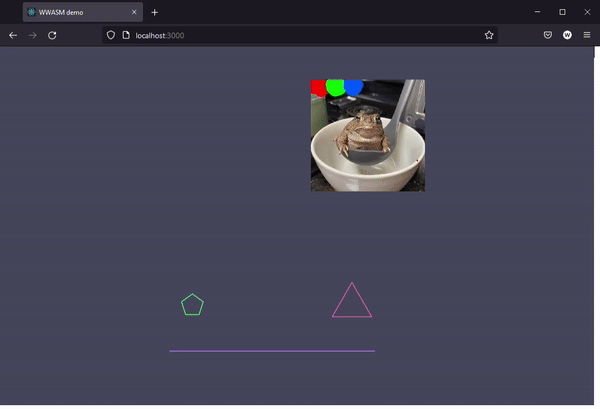
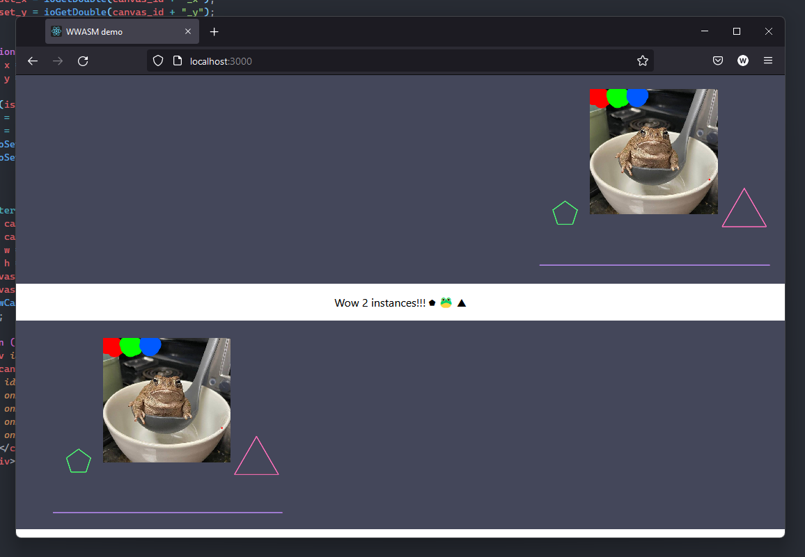

# WWASM liblary

`WWASM` (Wgmlgz wasm) - is a `c++` & `reactjs` liblary for connecting `c++` backend and `reactjs` frontend.

## Features

- ### **IO**
  Using `io<Get|Set><double|int>(str id)` methods read/write numbers at both sides. Strings are used as ids.

- ### **WCanvas**
  Create image stream at `c++` side using `wasm::Canvas` class and then render it to react `<WCanvas/>` component.

  Canvas features:

  - Store entities
  - Draw lines
  - Draw n-gons
  - Draw images
  - Zoom & drag with mouse
  - Auto resizing to match parent element size
  - Multiple instances
  - Animations
  - cpu (with `c++`) rendering
  - gpu (with `js`) rendering (faster probably)

# Usage
- ## `Js `
  Import:

    ```js
    import WCanvas from "./path/to/wwasm/canvas.jsx";
    ```

  Create react component like this:

    ```html
    <div>
      <WCanvas canvas_id="id_for_your_canvas" render="js|cpp(but js faster)" />
    </div>
    ``` 
  `WCanvas` will automacly scale to match parent component size.
- ## `C++`
  `wwasm` provides 2 methods: `init` & `update`. To use then you can use this code:
  ```cpp
  #include "wwasm.hpp"

  auto _init = wwasm::init([]() {
    ... init code ...
  });

  auto _update = wwasm::update([]() {
    ... update code ...
  });
  ```
- ## Images:
  You dont need to use both import methods if you are using only `js` or `c++` rendering.
  - ### `Js` rendering:
      Import:
      ```js
      import image1 from "./path/to/image/image1.jpg";
      import image2 from "./path/to/image/image2.jpg";
      ...
      ```
      You also need to place this stuff somwhere in your app:
      ```html
      <div className="hidden">
        
        
        ...
      </div>
      ```
  - ### `C++` rendering:
      To use images in `wwasm` you need to convert them to bytes array.
      The easiest way to do this is to use this command (linux or wsl).

      ```shell
      $ xxd -i imagename.bmp > imagename.hpp
      ```

      And then use like this:

      ```
      #include "./images/frog.hpp"
      canvas.pushEntity("frog", new wwasm::Img(
        {0, 0}, "frog", frog_bmp, frog_bmp_len
      ));
      ```


# Demo:




## TODO:

- opengl???
